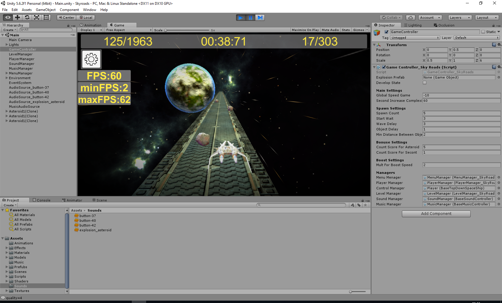

# Skyroads 3D (runer 3D)

## Task:
1) Realize the game by the image and video presented in the task. 
 The game is implemented in the form of a runner, where the player (stellar ship) moving must avoid obstacles (asteroids).
 When passing each second, the player must receive bonuses (2 bonuses), when passing each second with accelerated motion
 twice as many bonuses (when accelerating, the player's speed must be doubled).
2) Provided mesh, texture: the ship of the player, asteroid, planet, road, texture of the environment.
3) Player control (ship): a (left), d (right), in (up), with (down), space (acceleration).
4) The player should be aware of the following information in the game: bonuses, play time, number of asteroids
 (which could be avoided). This information should be kept between the game's launches and after leaving the game.
5) In the event of a collision with an asteroid, a window with the player's achievements should be opened, and
 information about the best parameters in the game: bonuses, best bonuses, time, best time, the number of asteroids
 avoided, the best number of asteroids avoided. The window should have buttons: "New game" and "Exit".
6) During the game, the game must be complicated: the speed of the ship increases, the distance between obstacles
 decreases, but so that the ship can pass between obstacles.

Additionally:
1) Add some effect to the acceleration mode of the ship.
2) Add partikles for the ship's engine, an explosion in the collision with the ship of the asteroid, etc.
3) Add sounds, music.
4) Add what you want to improve the game.

## Implemented:
All

## Unity 5.6.2

